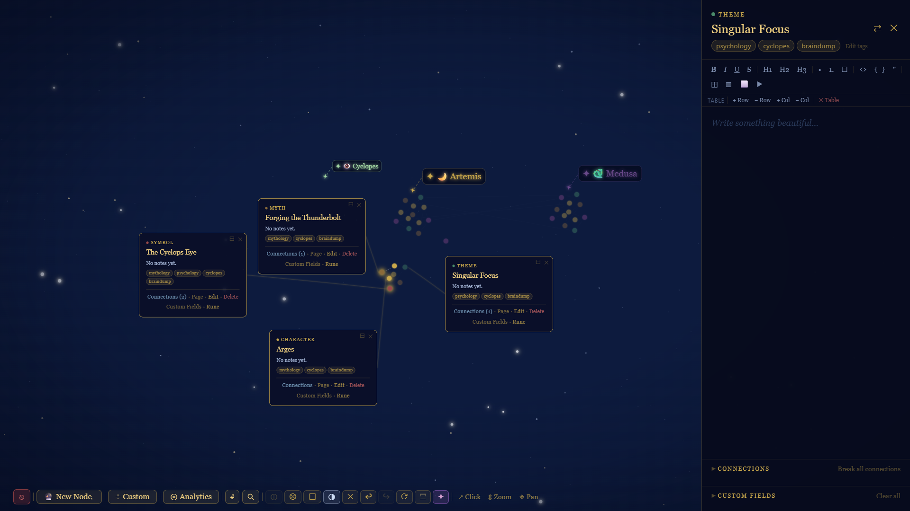
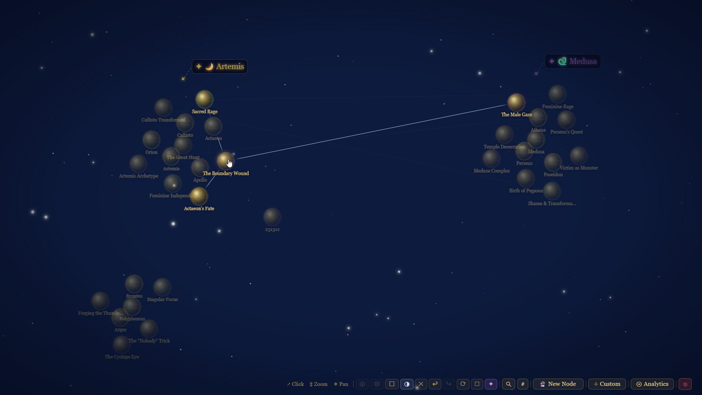
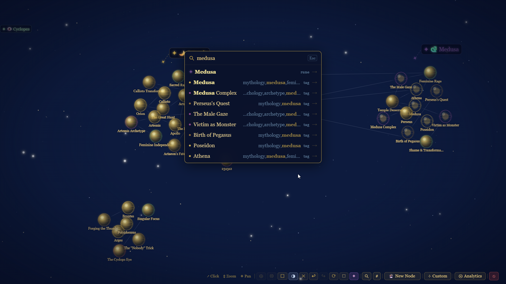
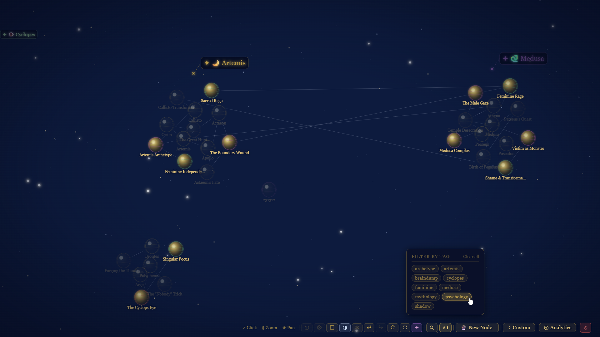
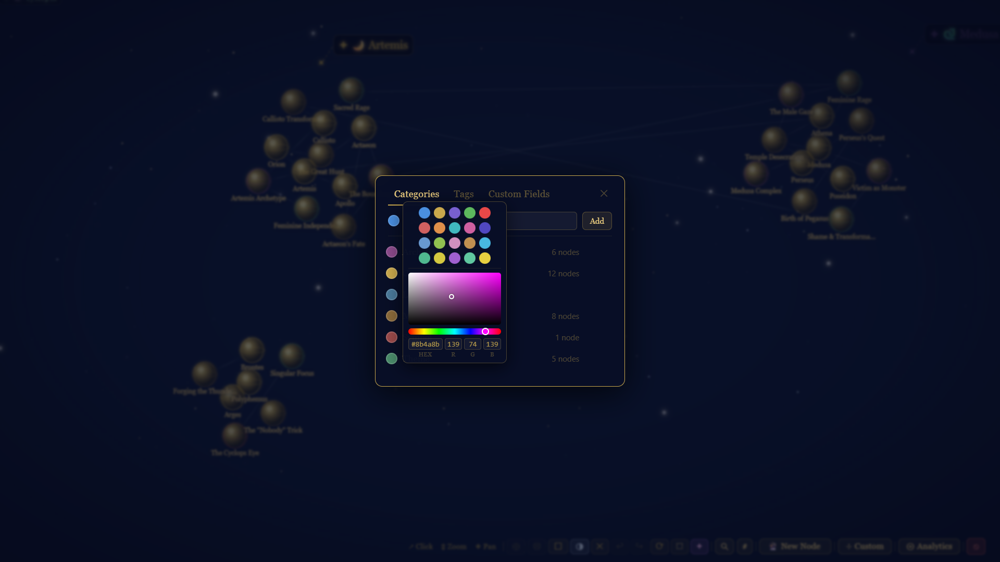

# :material-graph-outline: The Living Stars - a knowledge-graph star map

:material-briefcase-outline: **Type:** Full-stack web app, built while pairing with AI

:material-calendar-month-outline: **Date:** May 2026

:material-account-wrench-outline: **Role:** Solo build - design, front end, and database

---

_The Living Stars is a real, running app. This write-up is the product and build side; there's a companion write-up on the [infrastructure and operations](https://skyejen.github.io/devops/portfolio/living-stars/) that keep it live._

## :material-heart-outline: Why I built it { data-toc-label="Why I built it" }

I built this as a surprise for someone I love: a wildly creative, three-dimensional thinker who was drafting brilliant, sprawling ideas in spreadsheets. Rows and columns are the wrong shape for a mind like that. He needed room to breathe and to connect everything to everything, a canvas instead of a grid. So I built him one.

## :material-lightbulb-outline: What it is { data-toc-label="What it is" }

The Living Stars is an interactive star map for ideas. Every node is a glowing sphere floating in dark space, thin lines wire related ideas together, and the whole graph simulates physics so it settles into a shape you can zoom and pan around. Click a node and a floating card opens; open the side panel and you get a full rich-text page for that idea. It is built around how a visual, spatial person actually thinks: everything on one canvas, many things open at once, connected rather than filed away.

He always tried to describe the magic around how he thinks. I listened... I tried to bring it into life. It was a bit challenging to be a product owner of something without iterating with, essentially, the stakeholder, but I was dying to make it and to make it right. And to make it a surprise!

## :material-cog-outline: What it does { data-toc-label="What it does" }

- **Force-directed graph** - nodes simulate physics and their positions persist to the database.
- **Floating cards** - click a node to open a card; drag them freely, open many at once, with auto / locked-expanded / locked-collapsed view modes.
- **Wire connections** - drag from a node's handle to link it to another, with animated add and remove.
- **Rich side panel** - a Tiptap editor with headings, lists, tasks, tables, images, and YouTube embeds.
- **Categories and tags** - colour-coded categories with a full colour picker (hue, saturation, value), plus a tag filter that ghost-dims everything off-topic.
- **Fuzzy search** - across titles, tags, categories, and the rich-text page content.
- **Zoom-aware UI** - cards scale with zoom and switch to a compact format below a threshold; a re-centre action re-simulates the whole graph to fit the viewport.
- **Quality-of-life** - draft persistence across reloads, and group select-and-drag of multiple nodes or cards.

## :material-layers-outline: Tech stack { data-toc-label="Tech stack" }

- **Vite + vanilla JavaScript** - no framework, direct control of the DOM and the render loop.
- **D3** - the force simulation, zoom, and pan behind the star map.
- **Tiptap** - the rich-text editor (tables, task lists, images, YouTube embeds).
- **Fuse.js** - client-side fuzzy search.
- **Supabase (PostgreSQL)** - persistence for nodes, positions, categories, connections, and rich content.

## :material-school-outline: What I got out of it { data-toc-label="What I got out of it" }

This was end-to-end ownership of a real interactive product: the visual design, the graph interactions, the data model, the search, and persisting live UI state (positions, connections, view modes) back to a database. Getting a force simulation to feel good, and making a graph that stays readable as it grows, taught me a lot about both front-end craft and thinking in relationships rather than rows.

## :material-robot-outline: A note on AI { data-toc-label="A note on AI" }

I built this while pairing with AI, the way I work on everything: I drove the design and the decisions and used AI as a fast implementation partner and a way to learn unfamiliar pieces (D3 force simulation, Tiptap, Supabase) as I went. The direction, the judgement, and the "no, do it this way" were mine. I believe in being upfront about where AI helped.

## :material-server-network-outline: Under the hood { data-toc-label="Under the hood" }

This is a real, running system, hosted on Cloudflare and backed by a managed Postgres database, with automated deployments and scheduled backups. If you're interested in the infrastructure and operations side, there's a companion write-up in the DevOps hub: [The Living Stars - infrastructure and operations](https://skyejen.github.io/devops/portfolio/living-stars/).

## :material-image-multiple-outline: Screenshots { data-toc-label="Screenshots" }

All from a small Greek mythology AI-generated showcase dataset.

<figure markdown="span">

<figcaption>The star map: floating cards, colour-coded tags, and the rich-text side panel.</figcaption>
</figure>

<figure markdown="span">

<figcaption>Selecting a node lights up everything it's wired to.</figcaption>
</figure>

<figure markdown="span">

<figcaption>Fuzzy search across titles, tags, and page content, with everything off-topic ghost-dimmed.</figcaption>
</figure>

<figure markdown="span">

<figcaption>Tag filtering dims every node that doesn't match.</figcaption>
</figure>

<figure markdown="span">

<figcaption>Colour-coded categories with a full hue/saturation/value picker.</figcaption>
</figure>
